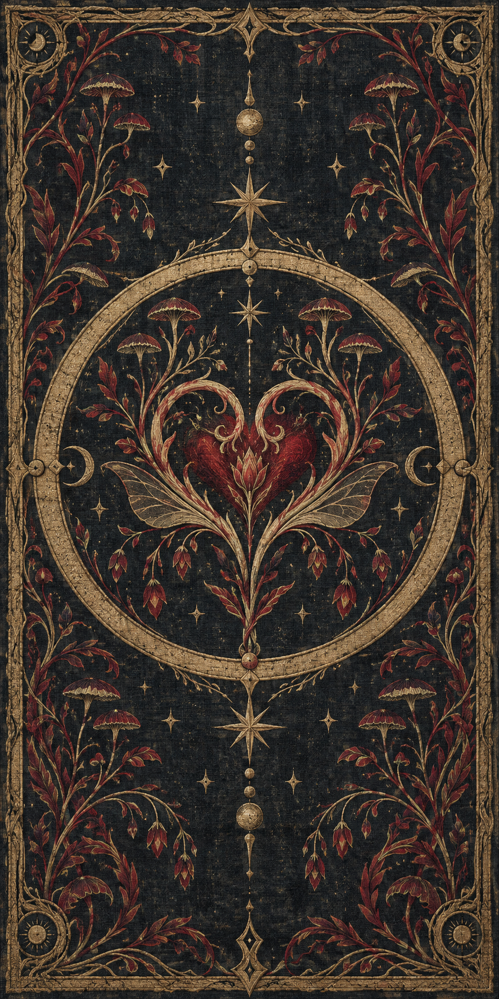

# HALVETH Morrowind Genesis 0.3.0

An open-source local companion and Lua mod for **OpenMW 0.51.0**: free-form conversations, separate memories for encountered characters, four explicit game actions, and an original Scarlet LOVE tapestry.

**Code and documentation: MIT.** Commercial use, modification and redistribution are permitted under the license. The generated banner has its own terms in [ASSET-LICENSE.md](ASSET-LICENSE.md). This repository distributes our extension, not Morrowind, OpenMW, a language model, or third-party graphics packs.



## Included

- Native **F8** game window and optional local browser companion.
- Local Ollama conversations with JARVIS and encountered NPCs/creatures.
- SQLite memory separated by campaign and character instance; lore indexing from your own installed game files.
- Explicit **heal**, **give gold**, **return to session start** and **return from the last teleport** actions, completed only after the game replies.
- Three original starter cards: HALVETH, LUCINET and RACHEL, plus built-in JARVIS.
- Eight original design summaries with commit-bound public source references, selected when relevant.
- Optional 887 × 1774 Scarlet LOVE tapestry and native F8 artwork.
- Original, Beauty and Cinematic profile helpers; a Rachel-style build board and generation atelier with production briefs.

This is a source release of an OpenMW extension. It is not a standalone game installer or Unreal conversion. New worlds, multiplayer, payments, blockchain and Steam distribution are future work.

## Quick start: companion and atelier

Install **Python 3.11 or later** with SQLite support. No pip dependencies are needed for the companion or unit tests.

```console
python server.py
```

Open **http://127.0.0.1:18765/**. The atelier and source cards work without the game; game actions need a connected OpenMW session. The server listens on loopback only and is not intended as a public web service.

For local model answers install [Ollama](https://ollama.com/) separately and obtain a model you are allowed to use. The default is `hermes3:8b`; weights and their license are not included. Choose an already installed model with `python server.py --model your-local-model-name`. Without a working model, the companion exposes a limited offline response path. It does not silently send conversations to a cloud provider.

## Connect your game

You need **OpenMW 0.51.0** and your own lawful Morrowind installation. The profile helper expects an installation root containing `engine/openmw.exe` (`engine/openmw` on Linux), matching `engine/resources/`, and `profiles/max/openmw.cfg` plus `settings.cfg`. Your configuration points to your existing game data. A standard OpenMW installation is not automatically converted into this layout.

```console
python launcher.py --install-root "D:/Games/MyOpenMW" --source-profile max
```

On Windows, `START.cmd` opens the Tk launcher. Other platforms use `python launcher.py`; Tk may need an OS package. See [SETUP.md](docs/SETUP.md) for the first-run configuration and direct CLI route. The optional banner is enabled with `python scripts/install_scarlet_banner.py apply`, followed by profile preparation and a game restart.

Press **F8** in a loaded game. NPC mode prefers the dialogue target, then the crosshair target, then a nearby actor. Model answers are generated fiction and can be inaccurate; design sources are not Morrowind lore or evidence of completed game actions.

## Preserve your world

Genesis uses separate `.local/profiles/`. Save copying is opt-in through `--copy-saves`; existing destination saves are not overwritten. Save a separate game before gameplay changes. Teleport return stores one prior position, not a general undo history.

The banner changes every use of one tapestry texture type, with no quest, NPC or economy records. Disable it with `python scripts/install_scarlet_banner.py restore`, prepare the profile again and restart OpenMW. See [SCARLET-ATELIER.md](docs/SCARLET-ATELIER.md).

## Develop and package

```console
python -m unittest discover -s tests -v
python scripts/build_release.py --check
python scripts/build_release.py
```

The release builder uses an explicit source/asset whitelist, resets starter cards and mailbox, checks license/provenance files and verifies archived bytes. Output goes to `dist/` with a checksum. Native tests require your own game/model and remain separate from dependency-free unit tests.

See [CONTRIBUTING.md](CONTRIBUTING.md), [PUBLIC-STATUS.json](PUBLIC-STATUS.json) and the Windows/Linux CI workflow. A defined workflow is not a hosted CI pass until GitHub runs it.

## License and content

MIT covers original code, documentation, UI and original design summaries. Banner terms are separate. Referenced upstream contents retain their own licenses; see [THIRD-PARTY-NOTICES.md](THIRD-PARTY-NOTICES.md).

No Bethesda archives/plugins, extracted lore, private character register, saves, conversations, credentials, model weights or downloaded mod packs are included. Optional donations will not be a condition of the MIT license.
